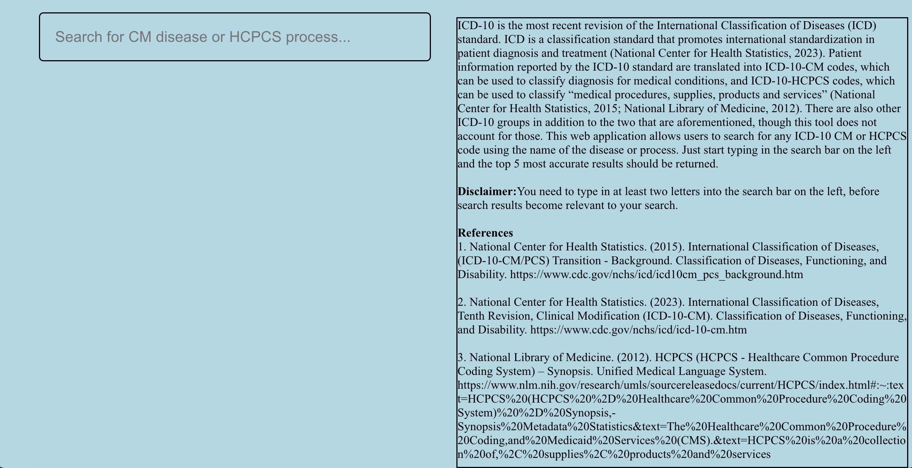
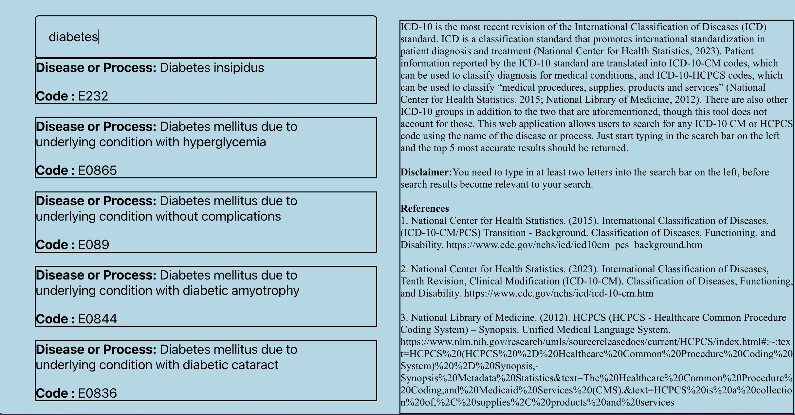

# How to Clone This Web Application Locally and Deploy It to a Local Host

You need Node.JS and Git installed on your local machine or container in which you want to deploy the web application.

To learn how to install Node.JS for your specific machine or environment, please reference the following website:

[https://nodejs.org/en](https://nodejs.org/en)

To learn how to install Git for your specific machine or environment, please reference the following website:

[https://docs.github.com/en/get-started/getting-started-with-git/set-up-git](https://docs.github.com/en/get-started/getting-started-with-git/set-up-git)

## Clone the React Project Locally

In a bash shell, navigate to the folder in which you want to clone the Git repository. Run the following commands:

`git clone https://github.com/szahidi3/szahidi3_cs6440_finalproject.git`

`cd szahidi3_cs6440_finalproject.git`

## Running the Web Application Locally

Install any dependencies by running:

`npm i`

If the installation shows any errors in the command line, run the following command to audit and fix any errors:

`npm audit fix`

Start the web application on a local host by running the following command:

`npm start`

Once the application finishes deploying locally, the command line output should return something like this:

`Compiled successfully!`

`You can now view szahidi3_cs6440_finalproject in the browser.`

`Local:            http://localhost:3000/szahidi3_cs6440_finalproject`

Open a web browser and navigate to the link that is shown after "Local" in this output (this might very for your particular machine, especially if you are using a container, but it is typically 
[ http://localhost:3000/szahidi3_cs6440_finalproject]( http://localhost:3000/szahidi3_cs6440_finalproject)

Once at the link, you can use the application.

## Remote Deploy
If you wish to deploy this application through a hosting service, or remotely in some other fashion, the process will vary depending on what approach you are using. Here is link to a guide that helped me deploy my project to GitHub pages:

[https://github.com/gitname/react-gh-pages](https://github.com/gitname/react-gh-pages)

## Using the Web Application

Navigate to [https://szahidi3.github.io/szahidi3_cs6440_finalproject/](https://szahidi3.github.io/szahidi3_cs6440_finalproject/) or the relevant link to your local/remote host if deploying the application yourself.

The user interface for the web application looks like this:

Scrolling down:

Simply click on the search bar shown in the screenshot and type in the name of the ICD-10 CM disease or HCPCS process and the search bar should return the five best matches for your search query, showing the name of the disease or process, as well as its ICD-10 code:

